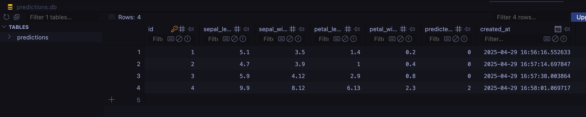
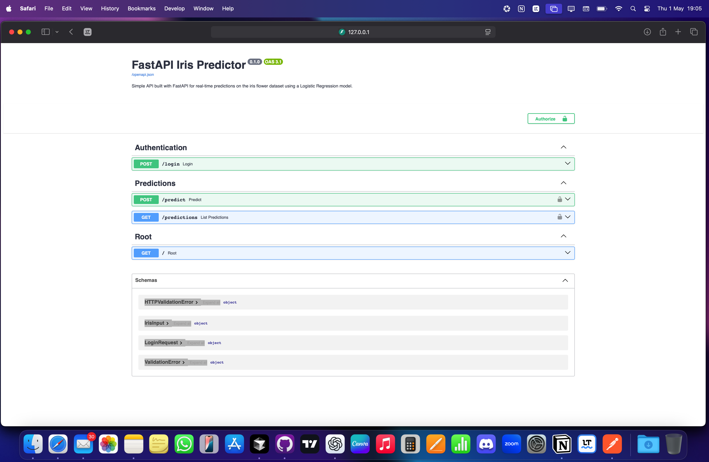

# ⚡️ FastAPI Iris Predictor

[](https://fastapi-iris-predictor.onrender.com)


Simple API built with [FastAPI](https://fastapi.tiangolo.com/) for real-time predictions on the [Iris flower dataset](https://en.wikipedia.org/wiki/Iris_flower_data_set) using a trained Logistic Regression model.

This project was inspired by a challenge during my postgraduate studies in Machine Learning Engineering at [FIAP](https://github.com/fiap). We first developed an API using Flask. I then decided to recreate and enhance the project using FastAPI as an exercise proposed by the instructor.

---

## 📚 Table of Contents

- [Features](#features)
- [Project Structure](#project-structure)
- [Authentication](#authentication)
- [Making Predictions](#making-predictions)
- [View Stored Predictions](#view-stored-predictions)
- [API Docs](#api-docs)
- [Poetry Usage](#poetry-usage)
- [Setup](#setup)
- [Deployment](#deployment)
- [Environment Variables](#environment-variables)
- [Logistic Regression Model](#logistic-regression-model)
- [Notes](#notes)
- [Author](#author)
- [License](#license)

---

## Features

- ✅ `/login` endpoint with JWT authentication
- ✅ `/predict` endpoint for making predictions using a trained model
- ✅ `/predictions` endpoint for listing all predictions stored in SQLite
- ✅ JWT token expiration logic
- ✅ Environment-based secret management
- ✅ SQLite database for persistent storage
- ✅ API docs auto-generated via Swagger

---

## Project Structure

```
fastapi-iris-predictor/
├── assets/                     # Screenshots for documentation
│   ├── docs-login.png
│   ├── docs-page.png
│   ├── login-postman.png
│   ├── predict-postman.png
│   ├── predictions-database.png
│   └── predictions-postman.png
├── models/
│   └── iris_logreg_model.pkl   # Trained Logistic Regression model
├── notebooks/
│   └── models.ipynb            # Jupyter notebook for training
├── src/
│   └── fastapi_iris_predictor/
│       ├── __init__.py
│       └── app.py              # Main FastAPI app
├── .env                        # Environment variables 
├── .env.example                # Example environment file
├── .gitignore                  # Files and folders ignored by Git
├── LICENSE                     
├── poetry.lock                 # Locked versions of all installed dependencies for consistent installs
├── pyproject.toml              # Project metadata and dependency configuration managed by Poetry
├── predictions.db              # Local SQLite database with stored predictions
├── README.md                   # Project documentation
├── render.yaml                 # Setup file for Render deployment
```

---

## Authentication

To obtain a JWT token, send a `POST` request to `/login`:

```json
{
  "username": "admin",
  "password": "secret"
}
```

✅ If successful, you'll receive an `access_token`.


---

## Making Predictions

Send a `POST` request to `/predict` with the following body and a Bearer token:

```json
{
  "sepal_length": 5.1,
  "sepal_width": 3.5,
  "petal_length": 1.4,
  "petal_width": 0.2
}
```

You’ll receive a predicted class like:

```json
{
  "predicted_class": 0
}
```


---

## View Stored Predictions

All predictions are stored in `predictions.db`.

You can view them via a `GET` request to `/predictions` (auth required):


Or preview the table using SQLite:



---

## API Docs

FastAPI automatically provides Swagger UI:

- [http://127.0.0.1:8000/docs](http://127.0.0.1:8000/docs)



Example view of the `/login` endpoint:


---

## Poetry Usage

This project uses [Poetry](https://python-poetry.org/) for dependency management and environment isolation. Poetry simplifies handling Python packages by:

- Managing the project's virtual environment
- Installing dependencies from `pyproject.toml`
- Keeping dependency versions locked via `poetry.lock`
- Providing an easy way to run scripts inside the virtual environment

### Common Commands

- Install dependencies:

  ```bash
  poetry install
  ```

- Activate the virtual environment:

  ```bash
  poetry env activate
  ```

- Run commands inside the environment without activating:

  ```bash
  poetry run <your-command>
  ```

Example (running the FastAPI app):

```bash
poetry run uvicorn src.fastapi_iris_predictor.app:app --reload
```

If you don't have Poetry installed, you can install it with:

```bash
curl -sSL https://install.python-poetry.org | python3 -
```

---

## Deployment

This project is deployed on [Render](https://render.com). You can explore the live API here:

👉 **[Run on Render](https://fastapi-iris-predictor.onrender.com)**

If you’d like to deploy your own version using the included `render.yaml` file, simply fork this repository and connect it to Render. The service will auto-deploy on push to `main`.

The `render.yaml` file contains configuration for:
- Python version
- Poetry setup
- Start command for Uvicorn

No additional configuration is required.

---

## Setup

### 1. Clone the repo

```bash
git clone https://github.com/luuisotorres/fastapi-iris-predictor.git
cd fastapi-iris-predictor
```

### 2. Install dependencies

```bash
poetry install
```

### 3. Copy the .env.example file to a .env file

```bash
cp .env.example .env
```

### 4. Run the app

```bash
poetry run uvicorn src.fastapi_iris_predictor.app:app --reload
```

---

## Environment Variables

This project requires the following environment variables, defined in the `.env` file:

| Variable               | Description                          |
|-------------------------|--------------------------------------|
| JWT_SECRET              | Secret key used to sign JWT tokens   |
| JWT_ALGORITHM           | Algorithm used for signing (default HS256) |
| JWT_EXP_DELTA_SECONDS   | Token expiration time in seconds (default 3600 = 1 hour) |
| DATABASE_URL            | Database connection string (uses SQLite locally) |
| TEST_USERNAME           | Username for testing authentication |
| TEST_PASSWORD           | Password for testing authentication |

💡 Tip: You can generate a new `JWT_SECRET` easily using: 
```bash
python -c "import secrets; print(secrets.token_urlsafe(32))"
```

---

## Logistic Regression Model

The Logistic Regression model was trained using the notebook located at `notebooks/models.ipynb`, and the resulting model was serialized as `iris_logreg_model.pkl` and placed in the `models/` directory.

---

## Notes

- Tokens expire after 1 hour for security.
- Predictions are stored locally in a SQLite Database for development and demo purposes.
- The `.env` file is critical for running the application. 

---

## Author

[Luis Fernando Torres](https://github.com/luisotorres)

[](https://www.linkedin.com/in/luuisotorres/)
[](https://medium.com/@luuisotorres)
[](https://www.kaggle.com/lusfernandotorres)
[](https://huggingface.co/luisotorres)


---

## License

MIT License